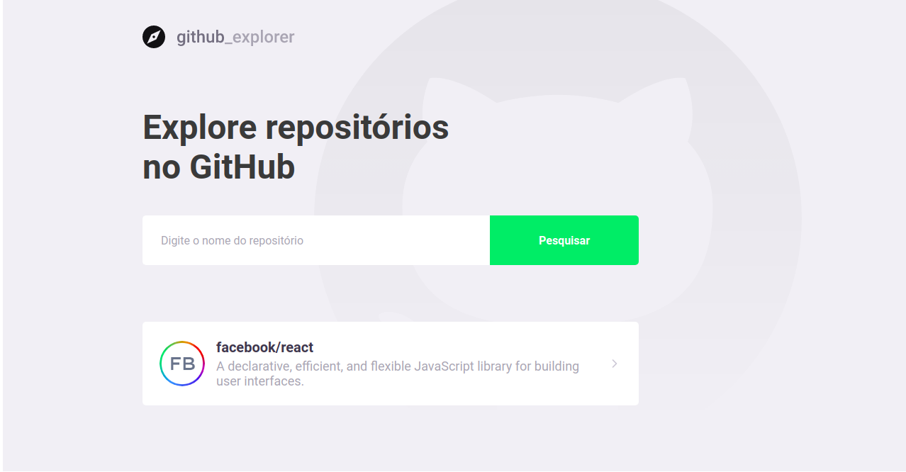
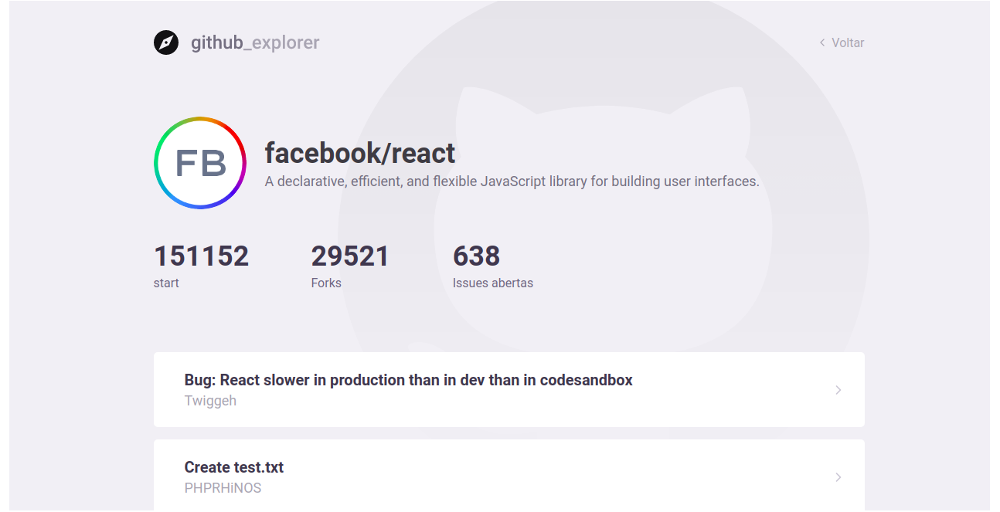

<h1 align="center">
  GitHub Explorer - Bootcamp by 
</h1>

### 🚀 O que é o GitHub Explorer ?

O GitHub Explorer é um dos primeiros projetos que o bootcamp da Rockseat para dar introdução aos conceitos de React com TypeScript. 💜

<p align="center">




</p>

## 🚀 Tecnologias

Esse projeto foi desenvolvido com as seguintes tecnologias:

- [React](https://reactjs.org)
- [TypeScript](https://www.typescriptlang.org/)
- [Styled Components](https://styled-components.com/)

## Instalação 👻

Clone ou faça o downlod desse repositório:

```
# Clone o repositório
$ git clone https://github.com/rafaelone/GitHUb-Explorer
```

Acesse a pasta server e faça as instalações:

```
# Acesse a pasta
$ cd GitHUb-Explorer

# Instale as dependencias
$ yarn
```

---

Agradecimentos [Rocketseat](https://rocketseat.com.br/) 🚀

👤 **Rafael Sergio**

- Github: [Rafael Sergio](https://github.com/rafaelone)
- Linkedin: [Rafael Sergio](https://www.linkedin.com/in/rafael-sergio-982951103/)
